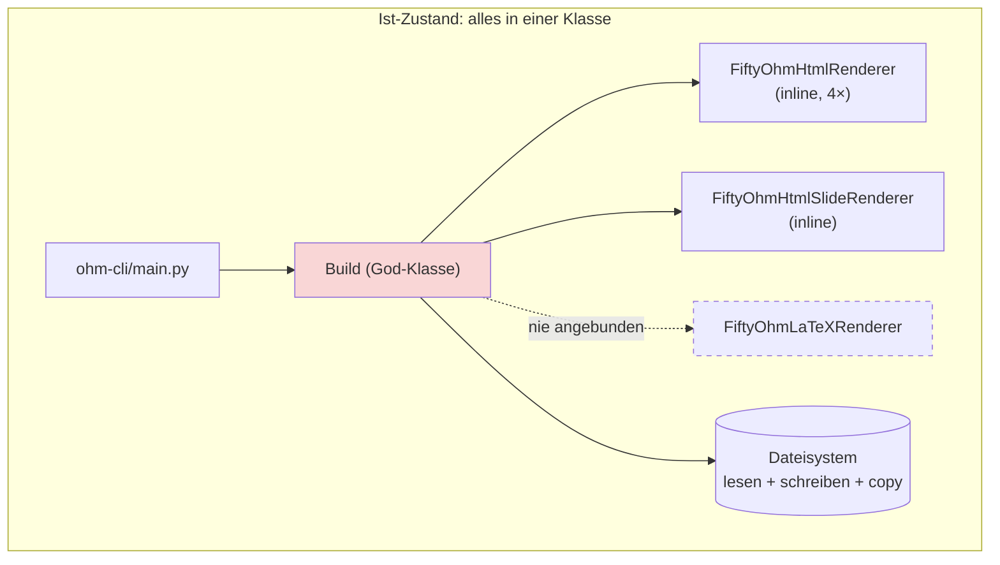
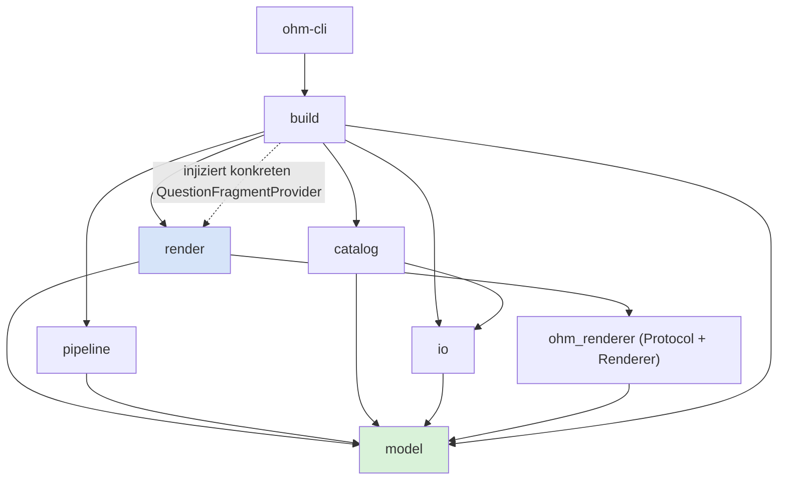
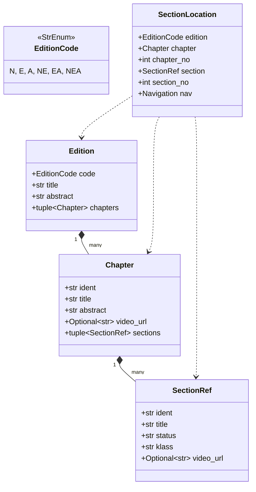
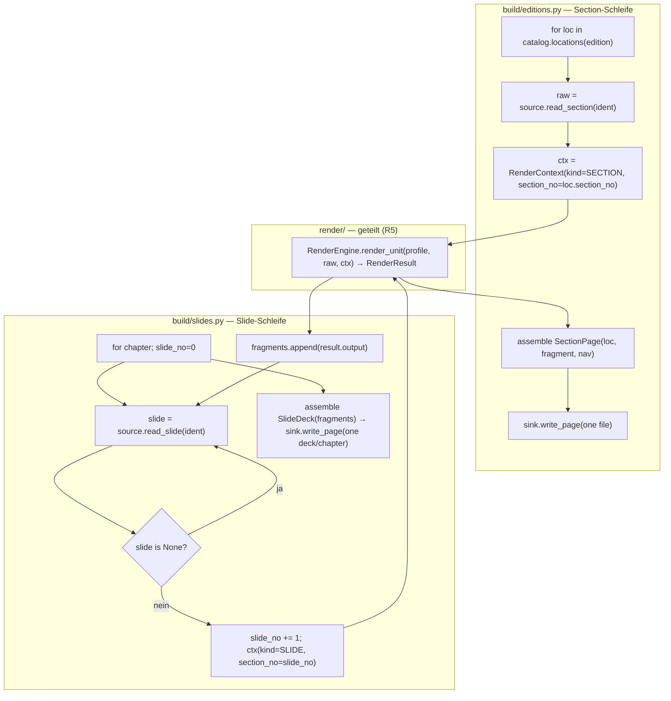
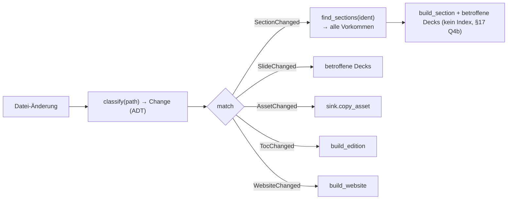
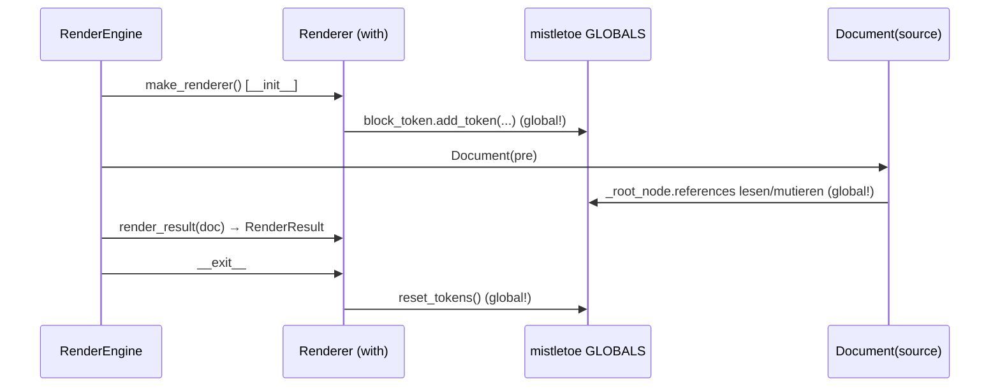

# Architektur: `ohm-builder` v2

Zielarchitektur für ein modularisiertes, testbares Builder-Package des 50ohm.de-Generators.
Dieses Dokument ist ein **Design-Vorschlag** — noch kein umgesetzter Code. Es wurde gegen den
Ist-Code geprüft und in mehreren kritischen Review-Runden korrigiert (siehe
[§13 Was die Review verändert hat](#13-was-die-review-verändert-hat)).

## Inhalt

1. [Ziele & Entscheidungen](#1-ziele--entscheidungen)
2. [Ist-Zustand (Kurzbefund)](#2-ist-zustand-kurzbefund)
3. [Schichten & Modul-Layout](#3-schichten--modul-layout)
4. [Domänenmodell (Dataclasses)](#4-domänenmodell-dataclasses)
5. [Input/Output-Ports](#5-inputoutput-ports)
6. [Die eine Render-Stelle: `RenderEngine`](#6-die-eine-render-stelle-renderengine)
7. [Orthogonale Matrix Format × Kind](#7-orthogonale-matrix-format--kind)
8. [Orchestrierung: die Schleifen, die sich unterscheiden](#8-orchestrierung-die-schleifen-die-sich-unterscheiden)
9. [Query-/Such-API (Ziel 2)](#9-query-such-api-ziel-2)
10. [Selektiver Rebuild & Watch (Ziel 3)](#10-selektiver-rebuild--watch-ziel-3)
11. [CLI-Anbindung (Ziel 1)](#11-cli-anbindung-ziel-1)
12. [Renderer-Umbau & mistletoe-Globalzustand](#12-renderer-umbau--mistletoe-globalzustand)
13. [Was die Review verändert hat](#13-was-die-review-verändert-hat)
14. [Verhaltens-Erhaltungs-Checkliste](#14-verhaltens-erhaltungs-checkliste)
15. [Bewusst vermiedene Über-Abstraktion](#15-bewusst-vermiedene-über-abstraktion)
16. [Migrationsplan](#16-migrationsplan)
17. [Detail-Entscheidungen](#17-detail-entscheidungen)

---

## 1. Ziele & Entscheidungen

**Ziele:**

- **Z1** — Renderer von außen wählbar (CLI-Parameter), erweiterbar um neue Formate.
- **Z2** — Editionen/Kapitel/Sections maschinenlesbar als Dataclass-Listen + Suche.
- **Z3** — Einzelnes Kapitel / einzelne Section rendern (→ Rebuild per Dateiname, Watch).

**Anforderungen:** R1 stärkere Modularisierung · R2 Input/Output getrennt · R3 Dataclasses ·
R4 Pre-/Postprocessing herausgelöst, pro Modus · R5 möglichst *eine* Stelle, an der der Renderer
aufgerufen wird (auch für Slides), nur die *äußeren* Strukturen unterscheiden Abschnitt/Slide ·
R6 idiomatisches, modernes Python.

**Getroffene Entscheidungen:**

- **D1** — Orthogonale Matrix Format × Inhaltsart.
- **D2** — Renderer darf umgebaut werden (einheitliches Protocol, Instanz-Zustand).
- **D3** — Reines Rendern + separate Output-Phase (kein Datei-Kopieren im Render-Pfad).
- **D4** — Interne Registry + Enum (kein entry-point-Plugin-System).

---

## 2. Ist-Zustand (Kurzbefund)

`Build` (`packages/ohm-builder/src/ohm_builder/build.py`, ~660 Zeilen) ist eine God-Klasse, die
Parsen, Rendern, Datei-Schreiben, Asset-Kopieren, Index-Bauen und Zippen vermischt.

| Problem | Beleg |
|---|---|
| Renderer an **4 Stellen** inline instanziiert | `__build_section`, `__build_chapter_slidedeck`, `__parse_snippets`, `build_solutions` |
| LaTeX-Renderer existiert, aber **nirgends angebunden** | kein LaTeX-Pfad in `Build` |
| TOC/Kapitel/Sections als rohe **dicts**, inline geparst; `section["content"]` reinmutiert | `build_edition` |
| `build_edition` monolithisch → **keine Einzel-Section-API** | `build_edition` |
| Bild-Handler **kopieren beim Rendern** und liefern gleichzeitig Alt-Texte | `__picture_handler`, `render_image` |
| Referenz-Nummerierung über **globalen** `mistletoe.token._root_node` | `referenced_token.py:9` |



---

## 3. Schichten & Modul-Layout

Strikte, azyklische Abhängigkeitsrichtung. `model` hängt von nichts ab; `io` und `ohm_renderer`
kennen `build` nicht. Die einzige potenzielle Zyklusquelle (Frage-Rendering) wird über ein
**Protocol in `render/`** aufgelöst (die konkrete, Jinja-gebundene Implementierung lebt in `build/`
und wird zur Laufzeit injiziert — siehe [§6](#6-die-eine-render-stelle-renderengine)).



```
ohm-builder/src/ohm_builder/
├── config.py                 # Pfad-Konfig (dataclass, pathlib)
├── model/                    # R3 — reine Daten, keine Logik, keine I/O
│   ├── catalog.py            #   Edition, Chapter, SectionRef, EditionCode(StrEnum)
│   ├── content.py            #   RenderContext, RenderResult, AssetRef, QuestionFragment
│   └── location.py           #   SectionLocation, Navigation
├── io/                       # R2 — Input/Output strikt getrennt
│   ├── source.py             #   ContentSource (Protocol) + FileSystemContentSource
│   │                         #     inkl. Alt-Text-Lookup + include_html (Input)
│   └── sink.py               #   OutputSink (Protocol) + FileSystemOutputSink
│                             #     EINZIGER Ort mit Schreib-Seiteneffekten (write/copy/zip)
├── catalog.py                # ContentCatalog: lädt TOCs → Modell, Query/Suche (Z2)
├── render/                   # Renderer-Auswahl + die EINE Render-Stelle
│   ├── protocol.py           #   OhmRenderer, RendererFactory, QuestionFragmentProvider (Protocols)
│   ├── profile.py            #   RenderProfile (frozen dataclass), RenderDeps
│   ├── profiles.py           #   _PROFILES = { (Format,Kind): RenderProfile } — eager dict (D4)
│   └── engine.py             #   RenderEngine — ALLEINIGER Renderer-Aufrufer (R5)
├── pipeline/                 # R4 — pro Modus, entkoppelt
│   ├── transforms.py         #   Preprocessor/Postprocessor = Callable-Aliase; slide_dashes
│   └── assemble.py           #   Assembler (Templates): SectionPage, ChapterIndex,
│                             #     CourseIndex, SlideDeck, SolutionPage, WebsitePage
└── build/                    # Orchestrierung — HIER unterscheiden sich die Schleifen (R5)
    ├── editions.py           #   build_edition / build_chapter / build_section (Section-Schleife)
    ├── slides.py             #   build_slidedeck (Slide-Schleife)
    ├── website.py            #   Snippets (inline-batch), statische Seiten, Startseite
    ├── solutions.py          #   Lösungsseiten
    ├── indexes.py            #   Aggregator: question_index.json / index.json (render-zeitlich, §17 Q4)
    ├── questions.py          #   QuestionFragmentProvider-Impl (Jinja + 404-Fallback + Asset-Rückkanal)
    ├── assets.py             #   Asset-Kopierphase (aus RenderResult.assets) — D3-Output
    └── selective.py          #   build_from_path(...) — Watch/Einzeldatei-Einstieg (Z3)

ohm-renderer/src/ohm_renderer/          # D2 — darf umgebaut werden
├── fifty_ohm_html_renderer.py          #   Instanz-Zustand; render_result()→RenderResult; kein copy
├── fifty_ohm_html_slide_renderer.py
├── fifty_ohm_latex_renderer.py         #   Ctor an gemeinsame Signatur angeglichen
└── ... Custom-Tokens unverändert ...
```

---

## 4. Domänenmodell (Dataclasses)

Frozen + `slots=True`, immutable Container als `tuple`, damit die Objekte hashbar/teilbar sind.
`EditionCode` bleibt eine `StrEnum` — der Slide-„S"-Suffix ist ein **Präsentations-Concern** und
wird *nicht* in den Editionscode geschmuggelt.



```python
# model/content.py
from dataclasses import dataclass
from .catalog import EditionCode
from render.registry import Kind          # SECTION | SLIDE

@dataclass(frozen=True, slots=True)
class RenderContext:
    """Alles, was der Renderer für Nummerierung/Referenzen braucht — formatneutral."""
    edition: EditionCode
    kind: Kind
    chapter_no: int
    section_no: int          # bei Slides: der Slide-Zähler (nur Slides ≠ None), NICHT section_no!
    output_ref: str          # roher Dateiname für [ref:]-Links (nutzt rohen EditionCode)

    @property
    def label_edition(self) -> str:
        # DIE EINE Stelle für den „S"-Suffix (Referenz-Labels wie „NS-1.1.2")
        return f"{self.edition}S" if self.kind is Kind.SLIDE else str(self.edition)

@dataclass(frozen=True, slots=True)
class AssetRef:
    kind: str                # "picture" | "photo"
    id: str

@dataclass(frozen=True, slots=True)
class IndexOccurrence:
    term: str
    subterm: str | None
    anchor_id: str                   # exakt der im HTML emittierte Anker → Anker == Index-Eintrag

@dataclass(frozen=True, slots=True)
class RenderResult:
    """Ergebnis eines Render-Aufrufs. Rein — keine Seiteneffekte (D3)."""
    output: str
    assets: tuple[AssetRef, ...]              # inkl. Assets aus Frage-Fragmenten & Includes (s. §14)
    questions: tuple[str, ...]                # render-zeitlich gesammelte Fragennummern (§17 Q4)
    index_terms: tuple[IndexOccurrence, ...]  # render-zeitlich gesammelte Index-Anker (§17 Q4)

@dataclass(frozen=True, slots=True)
class QuestionFragment:
    html: str
    assets: tuple[AssetRef, ...]     # Antwort-/Fragebilder — Rückkanal in die Asset-Sammlung
```

> **Warum `section_no` bei Slides der Slide-Zähler ist:** Der Ist-Code zählt im Slidedeck nur
> Sections mit `slide is not None` hoch (`section_counter`), nicht die Katalog-Position. Das prägt
> die Referenz-Labels. Diese Zählung ist ein Belang der **äußeren Slide-Schleife** (§8), nicht des
> Modells.

---

## 5. Input/Output-Ports

R2 verlangt saubere Trennung. Zwei Ports genügen (die frühere separate `AssetResolver`-Schicht
wurde in `ContentSource` gefaltet — Alt-Text/Includes sind Input-Lesevorgänge):

```python
# io/source.py — INPUT (nur lesen)
class ContentSource(Protocol):
    def read_toc(self, edition: EditionCode) -> Edition: ...
    def read_section(self, ident: str) -> str: ...
    def read_slide(self, ident: str) -> str | None: ...
    def read_snippets(self) -> Mapping[str, str]: ...
    def read_static_pages(self) -> Sequence[StaticPage]: ...
    def read_solution(self, number: str) -> str | None: ...
    def read_questions(self) -> QuestionCatalog: ...
    def alt_text(self, ref: AssetRef) -> str: ...          # Default bei fehlender .txt (s. §14)
    def include_html(self, ident: str) -> IncludeResult: ...  # HTML + darin referenzierte AssetRefs

# io/sink.py — OUTPUT (nur schreiben) — EINZIGER Ort mit Schreib-Seiteneffekten
class OutputSink(Protocol):
    def write_page(self, rel_path: str, content: str) -> None: ...   # legt Elternordner an
    def write_json(self, rel_path: str, data: object, *, sort_keys: bool) -> None: ...
    def copy_asset(self, ref: AssetRef) -> None: ...    # fängt FileNotFoundError, warnt, macht weiter
    def copy_static_assets(self) -> None: ...
    def make_archive(self, name: str | None = None) -> Path: ...
```

**D3 im Detail:** Der Renderer *liest* nur (Alt-Text via `ContentSource`) und *sammelt* referenzierte
`AssetRef`s. Das **Kopieren** passiert ausschließlich in der Output-Phase (`build/assets.py` →
`sink.copy_asset`). Damit ist „welche Assets braucht diese eine Section?" explizit — die Grundlage
fürs Watchen.

```
   INPUT                 PROCESS (rein)                         OUTPUT (Seiteneffekte)
 ┌──────────┐      ┌───────────────────────────┐       ┌────────────────────────────┐
 │Content   │─────▶│ preprocess → RenderEngine  │──────▶│ assemble (Templates)        │
 │Source    │ raw  │   → postprocess            │ frag  │   → sink.write_page         │
 │(FS)      │      │  ⇒ RenderResult(html,assets)│       │ sink.copy_asset(assets)     │
 └──────────┘      └───────────────────────────┘       │ sink.write_json (Indexe)    │
                                                        └────────────────────────────┘
```

---

## 6. Die eine Render-Stelle: `RenderEngine`

Kernauflösung des Spannungsfelds **D1 (Matrix) ↔ R5 (eine Render-Stelle)**:

> `RenderEngine` ist die **alleinige** Klasse, die einen Renderer instanziiert **und** aufruft.
> Kein anderer Teil des Codes berührt jemals einen Renderer. Section- und Slide-Schleifen rufen
> ausschließlich diese Klasse; sie unterscheiden sich nur in ihrer *äußeren* Struktur.

Warum die Instanziierung **in** die Engine muss (nicht nur der `.render()`-Aufruf): mistletoe
registriert Custom-Tokens **global** in `BaseRenderer.__init__` und räumt in `__exit__` auf; die
Tokenisierung von `Document(...)` liest genau diesen globalen Zustand. Konstruktion und `with`
müssen deshalb atomar zusammenliegen (siehe [§12](#12-renderer-umbau--mistletoe-globalzustand)).

```python
# render/engine.py
from dataclasses import replace

class RenderEngine:
    def __init__(self, deps: RenderDeps) -> None:
        self._deps = deps

    def render_unit(self, profile: RenderProfile, raw: str, ctx: RenderContext) -> RenderResult:
        """Vollständiges Dokument (Sections & Slides). Pre → render → post, atomar."""
        pre = _apply(profile.preprocess, raw, ctx)
        with profile.make_renderer(self._deps, ctx) as renderer:   # ctor+enter+parse+exit atomar
            result = renderer.render_result(Document(pre))         # → RenderResult (kein Attr-Griff)
        return replace(result, output=_apply(profile.postprocess, result.output, ctx))

    def render_inline_batch(
        self, profile: RenderProfile, sources: Mapping[str, str], ctx: RenderContext
    ) -> dict[str, RenderResult]:
        """Snippets: EIN Renderer über ALLE → Anker-Dedup & Zähler-Kontinuität bleiben erhalten."""
        with profile.make_renderer(self._deps, ctx) as renderer:
            return {key: renderer.render_inline_result(Document(raw)) for key, raw in sources.items()}
```

- `render_unit` kapselt die **komplette** Einheiten-Pipeline (Preprocess + Konstruktion + Render +
  Postprocess). Die äußeren Schleifen sehen nie einen Renderer — sie bekommen ein `RenderResult`.
- `render_inline_batch` ist der bewusste, eng begrenzte Sonderfall für Snippets: sie brauchen
  `render_inner`-Semantik **und** einen geteilten Renderer über alle Snippets (gemeinsame
  `index_anchor_ids`/`margin_id`-Kontinuität). Beides bleibt **innerhalb** der Engine — R5 gilt weiter.
- Das Ergebnis wird **explizit zurückgegeben** (`render_result` liest den Instanz-Zustand *innerhalb*
  des `with`), nicht über Attribute nach dem `with`-Block abgegriffen.

```python
# render/profile.py
type Preprocessor  = Callable[[str, RenderContext], str]    # PEP 695
type Postprocessor = Callable[[str, RenderContext], str]

class RendererFactory(Protocol):
    def __call__(self, deps: "RenderDeps", ctx: RenderContext) -> OhmRenderer: ...

@dataclass(frozen=True, slots=True)
class RenderDeps:
    questions: QuestionFragmentProvider   # Protocol (Impl in build/); löst Zyklus render↔build
    source: ContentSource                 # Alt-Text + include_html (Input)

@dataclass(frozen=True, slots=True)
class RenderProfile:
    fmt: Format
    kind: Kind
    make_renderer: RendererFactory
    preprocess: tuple[Preprocessor, ...] = ()
    postprocess: tuple[Postprocessor, ...] = ()
```

Assembly (Templates → volle Seite) ist **kein** Teil des Profils und der Engine — sie ist ein
separater Belang der Builder (`pipeline/assemble.py`), weil sie Domänenobjekte (`SectionRef`,
`Chapter`, `Edition`) und Flags (`course_wrapper`, `sidebar`) braucht und pro Seitentyp variiert.

---

## 7. Orthogonale Matrix Format × Kind

`Format` und `Kind` sind zwei orthogonale `StrEnum`s. Eine **eager** aufgebaute Dict-Map bildet
`(Format, Kind)` auf ein `RenderProfile` ab — kein mutables Modul-Global, keine
Import-Reihenfolge-Kopplung, kein Plugin-Overhead (D4).

```python
# render/registry.py
class Format(StrEnum):
    HTML = "html"
    LATEX = "latex"

class Kind(StrEnum):
    SECTION = "section"
    SLIDE = "slide"

# render/profiles.py  — an genau einer Stelle, eager gebaut
_PROFILES: Mapping[tuple[Format, Kind], RenderProfile] = {
    (Format.HTML,  Kind.SECTION): _html_section(),
    (Format.HTML,  Kind.SLIDE):   _html_slide(),
    (Format.LATEX, Kind.SECTION): _latex_section(),
    # (LATEX, SLIDE) existiert bewusst nicht → resolve() wirft UnsupportedProfile / resolve_optional() → None
}

def resolve(fmt: Format, kind: Kind) -> RenderProfile:
    try:
        return _PROFILES[fmt, kind]
    except KeyError:
        raise UnsupportedProfile(fmt, kind) from None

def resolve_optional(fmt: Format, kind: Kind) -> RenderProfile | None:
    return _PROFILES.get((fmt, kind))     # None → Bau-Schritt überspringen statt Fehler (§17 Q5)

def available_formats() -> frozenset[Format]:
    return frozenset(f for f, _ in _PROFILES)     # für CLI-Choices (Z1)
```

```
                Kind.SECTION                         Kind.SLIDE
            ┌────────────────────────────┐   ┌────────────────────────────────┐
Format.HTML │ HtmlRenderer               │   │ HtmlSlideRenderer               │
            │ preprocess: ()             │   │ preprocess: (slide_dashes,)     │
            │ postprocess: ()            │   │ postprocess: ()                 │
            └────────────────────────────┘   └────────────────────────────────┘
            ┌────────────────────────────┐   ┌────────────────────────────────┐
Format.LATEX│ LaTeXRenderer              │   │  — nicht registriert —          │
            │ preprocess: ()             │   │  (UnsupportedProfile)           │
            └────────────────────────────┘   └────────────────────────────────┘
```

Neues Format = neue Zeile in `_PROFILES` + Factory. Die Auswahl fließt als `Format` von der CLI
herein (Z1); `Kind` bestimmt die orchestrierende Schleife (§8).

---

## 8. Orchestrierung: die Schleifen, die sich unterscheiden

Nur hier lebt der Unterschied Abschnitt ↔ Slide. **Beide** rufen dieselbe
`engine.render_unit(...)`; sie unterscheiden sich ausschließlich in der äußeren Struktur:

- **Section:** eine Datei *pro Section* → assemble + write je Iteration.
- **Slide:** Fragmente *sammeln* → ein Deck *pro Kapitel* → einmal assemble + write.



```python
# build/editions.py
def build_edition(edition, *, catalog, source, sink, engine, fmt=Format.HTML):
    book = catalog.edition(edition)
    section_profile = resolve_optional(fmt, Kind.SECTION)   # None → Sections überspringen (§17 Q5)
    slide_profile   = resolve_optional(fmt, Kind.SLIDE)     #  "   → Slides  überspringen (§17 Q5)
    assemble.course_index(book, sink)                       # {ed}_course_index.html (Navigation)
    if slide_profile is not None:
        assemble.slide_index(book, sink)                    # {ed}_slide_index.html
    for chapter_no, chapter in enumerate(book.chapters, 1):
        assemble.chapter_index(book, chapter, chapter_no, sink)   # {ed}_chapter_{ident}.html
        if section_profile is not None:
            for loc in catalog.locations_in_chapter(edition, chapter.ident):
                _build_one_section(loc, section_profile, source, sink, engine)
        if slide_profile is not None:
            build_slidedeck(edition, chapter, profile=slide_profile, catalog=catalog,
                            source=source, sink=sink, engine=engine)

def _build_one_section(loc, profile, source, sink, engine) -> RenderResult:
    raw = source.read_section(loc.section.ident)
    ctx = RenderContext(edition=loc.edition, kind=Kind.SECTION,
                        chapter_no=loc.chapter_no, section_no=loc.section_no,
                        output_ref=naming.section(loc))       # roher EditionCode im Namen
    result = engine.render_unit(profile, raw, ctx)             # ← die eine Stelle
    page = assemble.section_page(loc, result.output)           # braucht Domänenobjekte + nav + flags
    sink.write_page(naming.section(loc), page)
    for ref in result.assets:
        sink.copy_asset(ref)                                   # D3-Output-Phase
    return result

def build_section(ident, *, catalog, ..., fmt=Format.HTML):   # Z3: eine Section, alle Vorkommen
    profile = resolve_optional(fmt, Kind.SECTION)
    if profile is None:
        return                                     # Format ohne Section-Profil → nichts tun (§17 Q5)
    for loc in catalog.find_sections(ident):
        _build_one_section(loc, profile, source, sink, engine)

def build_chapter(edition, chapter_ident, *, catalog, ...):    # Z3: ein Kapitel
    ...  # chapter_index + Sections des Kapitels + zugehöriges Deck
```

---

## 9. Query-/Such-API (Ziel 2)

`ContentCatalog` lädt alle TOCs einmal in das Dataclass-Modell und bietet maschinenlesbare Listen
sowie Suche. Rückgaben als `Sequence[...]` (re-iterierbar, read-only), nicht `Iterator`.

```python
class ContentCatalog:
    @classmethod
    def load(cls, source: ContentSource) -> Self:
        return cls({code: source.read_toc(code) for code in EditionCode})

    # Listen (Z2)
    def editions(self) -> Sequence[Edition]: ...
    def chapters(self, edition: EditionCode) -> Sequence[Chapter]: ...
    def sections(self, edition: EditionCode | None = None) -> Sequence[SectionRef]: ...

    # Suche + Basis für selektiven Rebuild (Z2/Z3)
    def find_sections(self, ident: str) -> Sequence[SectionLocation]:
        """Ein Ident kann in mehreren Editionen/Kapiteln vorkommen."""
    def locations(self, edition: EditionCode) -> Sequence[SectionLocation]: ...
    def locations_in_chapter(self, edition: EditionCode, chapter_ident: str) -> Sequence[SectionLocation]: ...
    def chapters_containing(self, ident: str) -> Sequence[tuple[EditionCode, Chapter]]: ...
```

`SectionLocation` kapselt Nummerierung + Navigation (`next_section` bzw. `next_chapter`), die heute
inline in der Riesen-Schleife berechnet werden. Damit wird eine einzelne Section mit korrektem
Kontext baubar (Z3), ohne die ganze Edition zu durchlaufen.

---

## 10. Selektiver Rebuild & Watch (Ziel 3)

Der Watch-Einstieg mappt eine geänderte Datei auf den minimalen Rebuild. Die geänderte Datei wird
zu einem **algebraischen Datentyp** klassifiziert (frozen dataclasses + PEP-695-Union) — nicht zu
einem Enum, weil `match/case` Payload (den `ident`) binden muss.

```python
# model — Change als ADT (NICHT Enum: Enum-Member sind keine Klassen-Pattern)
@dataclass(frozen=True, slots=True)
class SectionChanged: ident: str
@dataclass(frozen=True, slots=True)
class SlideChanged:   ident: str
@dataclass(frozen=True, slots=True)
class AssetChanged:   kind: str; ident: str
@dataclass(frozen=True, slots=True)
class TocChanged:     edition: EditionCode
@dataclass(frozen=True, slots=True)
class WebsiteChanged: pass

type Change = SectionChanged | SlideChanged | AssetChanged | TocChanged | WebsiteChanged

def build_from_path(path: Path, *, catalog, source, sink, engine, fmt=Format.HTML) -> None:
    match classify(path):                       # anhand des contents/-Unterordners
        case SectionChanged(ident):
            build_section(ident, ...)                       # alle Editionen, die ident enthalten
            for ed, ch in catalog.chapters_containing(ident):
                build_slidedeck(ed, ch, ...)                # Deck des betroffenen Kapitels
            # Index bewusst NICHT geschrieben — nur bei explizitem Full-Build (§17 Q4b)
        case SlideChanged(ident):
            for ed, ch in catalog.chapters_containing(ident):
                build_slidedeck(ed, ch, ...)
        case AssetChanged("drawing" | "photo" as kind, ident):
            sink.copy_asset(AssetRef(kind, ident))          # nur neu kopieren
        case TocChanged(edition):
            build_edition(edition, ...)                     # Struktur änderte sich → Edition neu
        case WebsiteChanged():
            build_website(...)
```



> **Index ist opt-in:** Die Vorkommens-Sammlung ist **render-zeitlich** (§17 Q4) — jedes
> Section-`RenderResult` trägt seine `questions`/`index_terms`. `question_index.json`/`index.json`
> werden aber **nur bei explizit aktivierter Index-Erzeugung** geschrieben (Full-/Produktions-Build,
> in dem ohnehin alle Sections gerendert werden → vollständig & konsistent). **Watch und
> Einzel-Section-Builds erzeugen keinen Index** — für den Watch-Anwendungsfall völlig okay und macht
> einen inkrementellen Aggregator/Sidecar überflüssig (§17 Q4b).

---

## 11. CLI-Anbindung (Ziel 1)

```python
@app.command()
def build(
    edition: Annotated[list[EditionCode], typer.Option(default_factory=lambda: list(EditionCode))],
    renderer: Annotated[Format, typer.Option(help="Ausgabeformat")] = Format.HTML,   # Z1
    input: Annotated[str | None, typer.Option("--input", "-i")] = None,
    output: Annotated[str | None, typer.Option("--output", "-o")] = None,
    write_index: Annotated[bool, typer.Option("--index/--no-index", help="Such-Index erzeugen")] = True,
) -> None:
    source  = FileSystemContentSource(Config(content_path=input, build_path=output))
    sink    = FileSystemOutputSink(...)
    catalog = ContentCatalog.load(source)
    idx     = IndexAggregator() if write_index else None      # §17 Q4b: nur wenn aktiviert
    engine  = RenderEngine(RenderDeps(questions=HtmlQuestionProvider(source, ...), source=source))
    for e in edition:
        build_edition(e, catalog=catalog, source=source, sink=sink, engine=engine, fmt=renderer, index=idx)
    if idx is not None:
        idx.write(sink)          # question_index.json / index.json — nur bei --index
```

Neue Unterkommandos werden dadurch möglich:

- `ohm section <ident>` → Einzel-Section (Z3)
- `ohm chapter <edition> <chapter>` → Einzel-Kapitel (Z3)
- `ohm list sections --edition N [--json]` → maschinenlesbar (Z2)
- `ohm watch` → `build_from_path` je Änderung (Z3) — **ohne Such-Index** (§17 Q4b)

---

## 12. Renderer-Umbau & mistletoe-Globalzustand

**D2-Umbau (`ohm-renderer`):**

- Neues `protocol.py`: `OhmRenderer` als **enges Consumer-Protocol**, das den Context-Manager-Aspekt
  mitführt und ein `RenderResult` liefert (statt drei rohe `collected_*`-Attribute nach außen):

  ```python
  class OhmRenderer(AbstractContextManager["OhmRenderer"], Protocol):
      def render_result(self, doc: Document) -> RenderResult: ...
      def render_inline_result(self, doc: Document) -> RenderResult: ...
  ```

  Die konkreten Renderer erben weiterhin von mistletoe (`HtmlRenderer`/`LaTeXRenderer`) — dort ist
  Vererbung richtig (echtes geteiltes Verhalten). Alle `render_*`-Overrides bekommen `@override`.
- Konstruktoren angleichen: LaTeX-Renderer nimmt dieselben Deps entgegen und sammelt Assets analog,
  statt sie zu ignorieren.
- Asset-Kopieren entfällt im Renderer (D3); stattdessen `AssetRef`-Sammlung im Instanz-Zustand,
  gemergt aus: Bild-Tokens **+** Frage-Fragmenten (`QuestionFragment.assets`) **+** Includes
  (`include_html` liefert die referenzierten `AssetRef`s mit).

**Wichtige Nebenbedingung — mistletoe ist nicht rein:** Die Referenz-*Nummerierung* entsteht **nicht**
im Renderer-Instanzzustand, sondern beim `Document(...)`-Bau: `ReferencedToken.__init__`
liest/mutiert das **globale** `mistletoe.token._root_node.references` während der Tokenisierung.
Zusätzlich registriert `BaseRenderer.__init__` Custom-Tokens global und `__exit__` setzt sie zurück.



Konsequenz für den Entwurf:

1. **Konstruktion muss in der Engine, atomar mit `with` liegen** — sonst leaken bei einer Exception
   die global registrierten Tokens, oder ein zweiter, vorab konstruierter Renderer überschreibt das
   globale Tokenset, bevor `Document(...)` parst.
2. **Der Global ist nur während `Document(...)` „scharf".** Er wird synchron am Anfang von
   `Document.__init__` gesetzt und am Ende auf `None` zurückgesetzt; dazwischen liegt kein
   `await`/Yield, und unser Tokenset konstruiert kein verschachteltes `Document`. Das **Rendern**
   (`renderer.render(doc)`) liest `_root_node` gar nicht. Damit ist der **sequentielle, einthreadige
   Betrieb bereits sicher** — die Gefahr besteht ausschließlich bei **gleichzeitiger Tokenisierung
   mehrerer Dokumente im selben Prozess** (Threads/asyncio).
3. Die D2-Migration „Klassen- → Instanz-Zustand" für `margin_id`/`margin_anchor_id` ist korrekt,
   aber ihr Nutzen ist begrenzt: durch `self.x += 1` verhalten sich diese Zähler faktisch bereits
   pro Instanz. Der eigentliche geteilte Zustand ist der **globale** `_root_node` — den adressiert
   die Umstellung nicht. (Ehrliche Einordnung, kein „Bugfix".)

### Lässt sich `_root_node` lokal loswerden? (empirisch geprüft)

**Literales Entfernen: nein, nicht ohne mistletoe-Fork.** Der Global hat vier Zugriffsstellen —
`Document.__init__` (schreibt, `block_token.py:145/147`), `CoreTokens.find` (liest,
`span_token.py:95`) und `Footnote.read` (liest, `block_token.py:838`) für Link-Referenz-/
Footnote-Auflösung, plus unser `ReferencedToken` (`referenced_token.py:9`) für die Abbildungs-/
Tabellennummerierung. mistletoe reicht `root` intern zwar teils als Parameter durch, greift ihn
aber am Einstieg aus dem Global — weil die `parent`-Kette zur Token-`__init__`-Zeit noch nicht steht.
Der Global ist damit **tragend**; er lässt sich nicht einfach herauslösen.

**Konkurrenzsicher machen: ja, lokal möglich — verifiziert.** Ein ~10-zeiliger `ContextVar`-Shim
ersetzt das Modul-Attribut durch einen kontextlokalen Wert:

```python
# ohm_renderer/_root_node_isolation.py  — einmalig beim Import anwenden
import contextvars
from types import ModuleType
from mistletoe import token as _token

_cv = contextvars.ContextVar("_root_node", default=None)

class _ContextLocalRoot(ModuleType):
    @property
    def _root_node(self):            # property (Data-Descriptor) verdrängt das Modul-Attribut
        return _cv.get()
    @_root_node.setter
    def _root_node(self, value):
        _cv.set(value)

_token.__dict__.pop("_root_node", None)
_token.__class__ = _ContextLocalRoot
```

Messergebnis (`scratchpad/root_node_*.py`): **ohne** Shim crasht die nebenläufige Tokenisierung
(`'NoneType' object has no attribute 'footnotes'`) und liefert falsche Ausgabe; **mit** Shim
0 Fehler über hunderte gleichzeitige Renderings — auch mit dem echten `FiftyOhmHtmlRenderer` inkl.
`[ref:]`-Nummerierung. Der Shim ist ein Monkeypatch eines Fremdpaket-Internas: bei mistletoe-Updates
neu verifizieren und die Version pinnen.

**Alternative ohne Monkeypatch:** Prozess-Isolation (`multiprocessing`) — jeder Prozess hat sein
eigenes Global. Für parallele Full-Builds die robustere Wahl; für in-Prozess-Threads/async ist der
ContextVar-Shim die elegantere.

> **Projektentscheidung (§17 Q6):** Der Build bleibt vorerst **sequentiell** — dieser Abschnitt ist
> reine Referenz für den Fall, dass Parallelisierung später doch nötig wird. Aktuell wird weder der
> Shim noch `multiprocessing` eingebaut.

---

## 13. Was die Review verändert hat

Der erste Entwurf wurde von drei Agenten (Anforderungserfüllung, Python-Idiomatik, Verhaltens­
abdeckung) adversarial geprüft. Die wesentlichen Korrekturen:

| # | Befund im ersten Entwurf | Korrektur in diesem Dokument |
|---|---|---|
| 1 | **R5 nur nominell erfüllt**: Renderer in beiden Schleifen instanziiert, Einheiten-Pipeline dupliziert, Assembler/Naming gabeln sich. | `RenderEngine` als *alleiniger* Renderer-Aufrufer; `render_unit` kapselt die komplette Einheiten-Pipeline; Assembly separat mit Domänenobjekten. |
| 2 | `match Changed.SECTION(ident)` auf **Enum mit Payload** → `TypeError`. | ADT aus frozen dataclasses + PEP-695-`type`-Union (§10). |
| 3 | Renderer nach `make_renderer` **außerhalb** `with` gereicht; „pure" behauptet. | Konstruktion **in** der Engine, atomar mit `with`; mistletoe-Globalzustand explizit dokumentiert (§12). |
| 4 | **Frage-/Solution-Bilder** entkommen der Asset-Sammlung → tote ``. | `QuestionFragment.assets` als Rückkanal; Merge in `RenderResult.assets` (§4/§12). |
| 5 | **Snippets** brauchen `render_inner`+`[3:-4]` und **einen** geteilten Renderer. | `render_inline_batch` in der Engine (Sonderfall bleibt intern) (§6). |
| 6 | „Eliminiert doppeltes Regex-Scannen" — **nicht verhaltensgleich** (Scope, Whitespace, Reihenfolge). | Bewusst gewählt (§17 Q4): **render-zeitliche** Sammlung wie References; Aggregator reichert mit Kontext an; Verhaltensänderung dokumentiert. |
| 7 | **Kapitel-/Kurs-/Slide-Index-Seiten** fehlten im Datenfluss. | Explizit in `build_edition` + `assemble.*` (§8). |
| 8 | **Fehlerbehandlung** (404-Fallback, fehlende Bilder, Default-Alt-Text) fehlte. | Als Erhaltungs-Pflicht spezifiziert (§14). |
| 9 | Registry als **mutables Modul-Global** + Import-Seiteneffekt. | Eager Dict-Literal, `UnsupportedProfile` (§7). |
| 10 | **Zyklus** render↔build über `QuestionRenderer`. | `QuestionFragmentProvider`-Protocol in `render/`, Impl in `build/` (§3/§6). |
| 11 | `RenderContext.edition: str` mit „S"-Suffix-Hack. | `EditionCode` + `label_edition`-Property; Dateiname nutzt rohen Code (§4). |
| 12 | Über-Abstraktion (`NamingScheme`-Objekte, 3 Pipeline-Protokolle, `AssetResolver`). | Entschlackt (§15). |

---

## 14. Verhaltens-Erhaltungs-Checkliste

Diese Ist-Verhalten **müssen** der Umbau überleben (P0-Golden-Master, §16). Aus der Grounding-Review:

- [ ] **404-Fallback** für fehlende Frage/Metadaten (`layout="not-found"`, `number=404`, Ersatztext)
      inkl. roter Fehlerausgabe. *(Achtung: bestehender Bug `f"Frage {input}"` statt `{number}` —
      siehe [§17](#17-detail-entscheidungen).)*
- [ ] **`shuffle_answers`**-Jinja-Filter (erste Antwort korrekt, dann `random.shuffle`).
- [ ] **Frage-/Antwort-/Solution-Bilder** werden kopiert (über `QuestionFragment.assets`).
- [ ] **Include-Handler** scannt eingebundenes HTML nach `(\d+)\.svg` und kopiert diese.
- [ ] **Fehlende Bilder** → Warnung + weiter (kein Abbruch); fehlende `.txt` → Default-Alt-Text.
- [ ] **Kapitel-Index** (`{ed}_chapter_{ident}.html` + next_chapter), **Kurs-Index**
      (`{ed}_course_index.html`), **Slide-Index** (`{ed}_slide_index.html`).
- [ ] **Navigation**: `next_section` **elif** `next_chapter` (Präzedenz erhalten).
- [ ] **`__build_page`**-Flags `course_wrapper` (bool) und `sidebar` (str|None) im Section/Static-Assembler.
- [ ] **Slide-Zählung** `section_counter` (nur Slides ≠ None), **nicht** Katalog-`section_no`.
- [ ] **Slide-Dateiname** nutzt rohen EditionCode „N", Referenz-Label nutzt „NS".
- [ ] **Snippet-Kontinuität** (geteilte `index_anchor_ids`/`margin_id` über alle Snippets).
- [ ] **Statische Seiten** werden **nicht** durch mistletoe gerendert; `X_sidebar.html`-Pairing.
- [ ] **`build_website`**: exakte Seitenmenge + zwei Mechanismen (Template+Snippets vs. Static+Sidebar).
- [ ] **`render_document`**-Semantik pro Renderer: HTML `references.update`+`footnotes.update`+Trailing-`\n`;
      LaTeX nur `footnotes.update`, kein `references`, kein `\n`.
- [ ] **JSON-Format**: `question_index.json` mit `sort_keys=True`; `index.json` (Liste) **ohne**,
      mit exaktem Sortierschlüssel (`casefold` term/subterm/section/anchor); beide `indent=2`,
      `ensure_ascii=False`, Trailing-`\n`.
- [ ] **Index opt-in** (§17 Q4b): nur bei explizit aktivierter Erzeugung (Full-Build); Watch/Einzel-Build ohne Index.
- [ ] **`index.json`-Dedup** per `entry_key = f"{section}#{anchor_id}"`; `editions` in Reihenfolge, dann sortiert.
- [ ] **Vorkommens-Sammlung render-zeitlich** (§17 Q4): nur Section-`RenderResult`s speisen den Index
      (Scope wie heute); Tokens in nicht-gerenderten Bereichen (Kommentare/`latexonly`) fallen bewusst weg.
- [ ] **`edition.upper()`**-Normalisierung.
- [ ] **`build_assets` vor Index-JSON** (bzw. `write_json` legt `assets/` an).
- [ ] **`build_zip`**: deterministisch sortiert, sich selbst ausschließend, `ZIP_DEFLATED`.
- [ ] **Fortschritts-/Reporting-UX** (heute `rich.Progress` + `tqdm.write`).

---

## 15. Bewusst vermiedene Über-Abstraktion

Die YAGNI-Review hat folgende Vereinfachungen gegenüber dem ersten Entwurf begründet:

- **Kein `NamingScheme`-Objekt** pro Profil — Dateinamen sind triviale f-Strings (`naming.section(loc)`
  als Funktion). Ein Objekt-Hierarchie wäre gleichzeitig zu viel Zeremonie und (für Chapter-/Index-
  Namen) unvollständig gewesen.
- **Keine drei Pipeline-Protokoll-Hierarchien** — es gibt real *einen* Preprocessor (`slide_dashes`)
  und aktuell *keinen* echten Postprocessor. `Preprocessor`/`Postprocessor` sind schlichte
  PEP-695-`Callable`-Aliase; freie Funktionen passen strukturell.
- **`AssetResolver` in `ContentSource` gefaltet** — Alt-Text/Includes sind Input-Lesevorgänge; ein
  eigener dritter Port war Zeremonie und hätte die Fehler-Default-Semantik zwischen zwei Komponenten
  aufgespalten.
- **Registry als Dict-Literal** statt `register()/resolve()`-Maschinerie mit self-registrierenden
  Modulen (D4 verlangt nur „intern", kein Plugin-System).
- **`Assembler` nur als Protocol mit reicher Eingabe**, konkrete Assembler als wenige Funktionen —
  keine Registry, kein Über-Bau (es gibt 2–3 konkrete).
- **Volltext-`search()` verworfen** — für Z2 genügen `sections()`/`find_sections()`/`locations()`;
  Volltext ohne konkrete User-Story ist YAGNI.

---

## 16. Migrationsplan

Phasiert, jede Phase grün testbar. Reihenfolge so, dass früher Nutzen entsteht (Z2 zuerst).

| Phase | Inhalt | Liefert |
|---|---|---|
| **P0** | **Golden-Master-Test**: Ist-`build/`-Output einer Referenz-Edition einfrieren (Datei-für-Datei-Diff). | Sicherheitsnetz für alle folgenden Phasen. |
| **P1** | `model/` + `ContentCatalog` + `FileSystemContentSource.read_toc`. | **Z2** (`list`-Kommandos) ohne Render-Umbau. |
| **P2** | `OutputSink`/`ContentSource` einführen; `Build`-Schreibzugriffe dahinterziehen. | **R2**. |
| **P3** | Renderer-Umbau (**D2**): `render_result`/`render_inline_result`, Asset-Sammlung inkl. Frage-/Include-Assets, **render-zeitliche Vorkommens-Sammlung** (Fragen/Index, §17 Q4), `@override`. Renderer-Tests mitziehen. | Reiner Renderer (**D3**-Basis). |
| **P4** | `RenderEngine` + Matrix (**D1/R5**); HTML-Section/-Slide-Profile; `Build`-Renderaufrufe darauf umstellen. **Kapitel-/Kurs-/Slide-Index** mitnehmen (§14). | **R5**, eine Render-Stelle. |
| **P5** | `pipeline/` (Pre/Post + Assembler); Snippets (`render_inline_batch`), Solutions, Static, Website. | **R4**. |
| **P6** | `build_section`/`build_chapter`, `build_from_path`, `ohm section/chapter/list/watch`, `--renderer`. | **Z1/Z3**. |
| **P7** | LaTeX-Profil über dieselbe Engine anbinden (war bisher tot). | Zweites Format. |
| **P8** | God-Klasse `Build` entfernen. | Aufräumen. |

**Risiken** (in P3/P4 als Abnahmekriterien führen): Referenz-/Nummerierungssemantik exakt erhalten;
mistletoe-Globalzustand (§12); Slide-„S"-Suffix an genau einer Stelle; Index-Sortierung stabil;
Snippet-Anker-Kontinuität; JSON-Byte-Identität gegen Golden-Master.

---

## 17. Detail-Entscheidungen

Feinere Umsetzungs-Entscheidungen — inzwischen **alle getroffen** (Stand je Punkt vermerkt):

1. **Rebuild-Granularität — ENTSCHIEDEN:** Bei geändertem Section-Ident werden **alle Editionen neu
   gebaut, die den Ident enthalten** (`find_sections`). Ein optionaler `--edition`-Filter kann später
   additiv nachgerüstet werden, falls Watch träge wird.
2. **`alt="None"`-Eigenart — ENTSCHIEDEN: normalisieren.** Fehlt ein Bild, liefert `alt_text` denselben
   Default wie bei fehlender `.txt` („Bildbeschreibung noch nicht verfügbar"). Das heutige `alt="None"`
   (Picture) bzw. `alt=""` (Photo) entfällt zugunsten eines einheitlichen Textes.
3. **404-Fallback-Bug — ENTSCHIEDEN: fixen.** `f"Frage {input} nicht gefunden"` → `f"Frage {number}
   nicht gefunden"` (nutzt die Fragennummer statt der Builtin-Funktion `input`).
4. **Vorkommens-Sammlung — ENTSCHIEDEN: render-zeitlich (wie References).** `render_question`/
   `render_index` sammeln beim Rendern in den Renderer-Instanzzustand; `RenderResult` trägt
   `questions`/`index_terms`; ein Aggregator reichert sie mit Kontext aus `SectionLocation`
   (Kapitel-/Section-Titel, Edition) + `has_solution` an. Bewusste Verhaltensänderung ggü. heute:
   Tokens in Block-Kommentaren/`latexonly`/`webonly`, die nicht ins HTML gerendert werden, erscheinen
   **nicht mehr** im Index (Anker == Eintrag). Zwei Folge-Entscheidungen noch offen:
   - **4a Scope — ENTSCHIEDEN:** Nur **Section**-Renderergebnisse speisen den Index (heutiger Scope);
     Slides/Solutions bleiben außen vor.
   - **4b Selektiver Rebuild — ENTSCHIEDEN:** Index-Erzeugung ist **opt-in** (explizites `--index`).
     **Watch und Einzel-Section-Builds schreiben keinen Index** — für den Watch-Anwendungsfall völlig
     okay. Damit entfällt der inkrementelle Aggregator/Sidecar; der Index entsteht ausschließlich im
     Full-Build, in dem ohnehin alle Sections gerendert werden. (Default von `--index` für den
     Produktions-Build: **an**; Watch schreibt ihn strukturell nie — anpassbar.)
5. **Fehlendes Profil — ENTSCHIEDEN: überspringen (für Sections UND Slides).** Alle Bau-Schritte
   reichen `fmt` durch und lösen über `resolve_optional(fmt, kind)` auf; ist die Zelle nicht
   registriert (`None`), wird der Schritt **sauber übersprungen** statt hart HTML zu erzwingen oder zu
   crashen. Beispiel: `--renderer latex` baut Sections als LaTeX und überspringt die Slides (kein
   `(LATEX, SLIDE)`-Profil); umgekehrt würde ein Format, das nur Slides registriert, die Sections
   überspringen. (Z1-konform, erweiterbar via D1/D4.)
6. **Parallelisierung — ENTSCHIEDEN: sequentiell bleiben.** Der Build läuft sequentiell; das ist heute
   sicher (§12) und schnell genug. Der `ContextVar`-Shim und `multiprocessing` bleiben **dokumentierte
   Optionen** (§12) für den Fall, dass die Full-Build-Zeit später doch zum Problem wird — die
   Architektur legt sich nicht fest (Renderer-Konstruktion ist atomar, daher jederzeit nachrüstbar).
